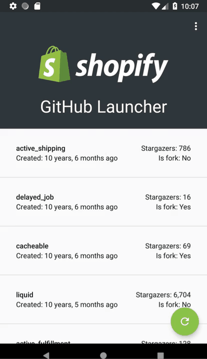

# android.github.shopify

A demostration app with a single recycler view, displaying public repositories for the Shopify organisation using the Github Developer API.

The recycler view displays the following information:

* Name
* If it is a fork or not (Y/N)
* Number of stargazers
* Time since it was created
* An interaction on the row which opens the user's browser to the repository's page

Goals:

* Solve the problem using Android (Kotlin preferred)
* Retrofit
* Back the recycler view with some type of cache or persistence layer
* Use an architecture pattern

# Architecture Pattern

The architectural pattern chosen was Model-View-Presenter (MVP) as a balance between separation of concerns, existing knowledge and speed to a minimum viable product.

# Libraries

3rd party libraries:

* okhttp
* retrofit
* joda-time

Google:

* gson
* recyclerview
* room

# To Do

* Rx - too much work is being done on the UI thread leading to some UI jank on the emulator when loading items
* Dagger - at the moment injection is handled by an object that can be override for unit tests via product flavours
* Clean - implement use cases and separate layers into data / domain / presentation
* Items - Revamp the styling of list items, add the stargazers icon and maybe the forked from text (from GitHub)

# Resources

* [Shopify on GitHub](https://github.com/Shopify)
* [GitHub Developer](https://developer.github.com)
* [Shopify Repositories via GitHub Developer API](https://api.github.com/orgs/shopify/repos)
* [Postman](https://www.getpostman.com/)
* [Android Architecture Blueprints](https://github.com/googlesamples/android-architecture)
* [Android Sunflower](https://github.com/googlesamples/android-sunflower)
* [Cheesesquare Sample](https://github.com/chrisbanes/cheesesquare)
* [Best practices in Android development](https://github.com/futurice/android-best-practices)
* [Complete Android Fragment & Activity Lifecycle](https://github.com/xxv/android-lifecycle)
